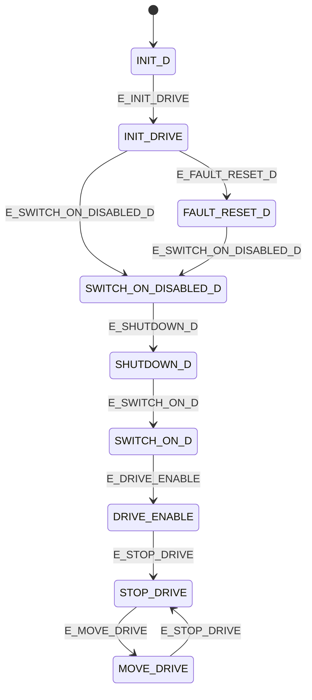

```mermaid

stateDiagram-v2
    [*] --> INIT_D

    INIT_D --> INIT_DRIVE : E_INIT_DRIVE

    INIT_DRIVE --> FAULT_RESET_D : E_FAULT_RESET_D
    INIT_DRIVE --> SWITCH_ON_DISABLED_D : E_SWITCH_ON_DISABLED_D

    FAULT_RESET_D --> SWITCH_ON_DISABLED_D : E_SWITCH_ON_DISABLED_D

    SWITCH_ON_DISABLED_D --> SHUTDOWN_D : E_SHUTDOWN_D

    SHUTDOWN_D --> SWITCH_ON_D : E_SWITCH_ON_D

    SWITCH_ON_D --> DRIVE_ENABLE : E_DRIVE_ENABLE

    DRIVE_ENABLE --> STOP_DRIVE : E_STOP_DRIVE

    STOP_DRIVE --> MOVE_DRIVE : E_MOVE_DRIVE

    MOVE_DRIVE --> STOP_DRIVE : E_STOP_DRIVE
    
```

