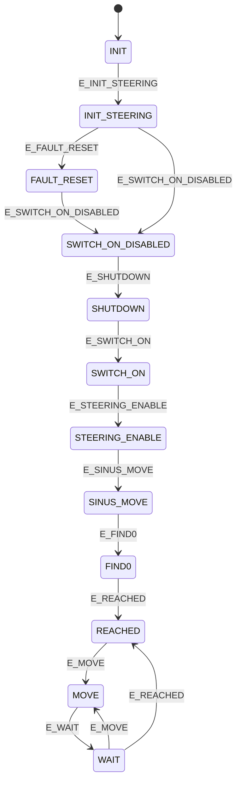

```mermaid

stateDiagram-v2
    [*] --> INIT

    INIT --> INIT_STEERING : E_INIT_STEERING

    INIT_STEERING --> FAULT_RESET : E_FAULT_RESET
    INIT_STEERING --> SWITCH_ON_DISABLED : E_SWITCH_ON_DISABLED

    FAULT_RESET --> SWITCH_ON_DISABLED : E_SWITCH_ON_DISABLED

    SWITCH_ON_DISABLED --> SHUTDOWN : E_SHUTDOWN

    SHUTDOWN --> SWITCH_ON : E_SWITCH_ON

    SWITCH_ON --> STEERING_ENABLE : E_STEERING_ENABLE

    STEERING_ENABLE --> SINUS_MOVE : E_SINUS_MOVE

    SINUS_MOVE --> FIND0 : E_FIND0

    FIND0 --> REACHED : E_REACHED

    REACHED --> MOVE : E_MOVE

    MOVE --> WAIT : E_WAIT

    WAIT --> REACHED : E_REACHED
    WAIT --> MOVE : E_MOVE
    
```

